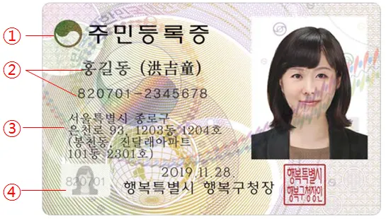

# Card Detection

## Overview

1. The Characteristics of ID Card
2. The Details of ID Card

### The Characteristics of ID Card

- The Standardized Size : `( 8.6, 4.5, )`
- [The Formalized Form of Datas](./README.md#the-details-of-id-cards)
- A Variety of colors and patterns
- Factors may interfere with Contours Detections
    - Face Photo
    - Red Colors' Seal

### The Details of ID Card

> This image is dstributed as 'Public Nuri Type One'.
>
> This image is distributed under its license and may only be redistributed under this condition.
> You have the following rights to this image.
> 
> - Sharing - sharing and using online and offline.
> - Change - Transformation, change to secondary work.
> - Commercial Use - Use of Works for Commercial Use
> 
> The following conditions must be followed:
> 
> Source Indication - The source or copyright holder of a public work must be indicated. For this purpose, if it is possible to provide a hyperlink to the source online, you should provide that link. However, in the process of indicating the source, the user shall not make an indication that may be mistaken by a third party as if a public institution sponsors the user or there is a special relationship between the public institution and the user.

## Module Description

